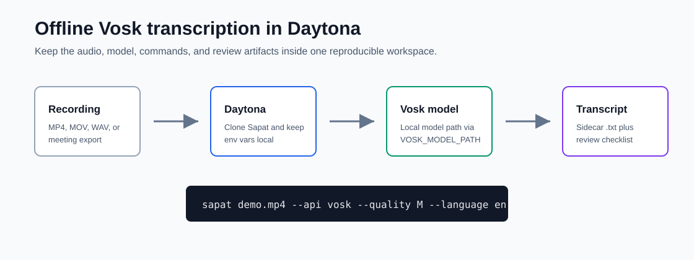

# Run Vosk Transcription With Sapat in Daytona

# Introduction

Hosted transcription APIs are convenient, but they are not always the right
default. Product demos, customer calls, internal design reviews, and incident
recordings often contain material that should not leave the team environment
until someone has reviewed it. A local speech-to-text model gives engineers a
practical middle path: generate a draft transcript fast, keep the data path
visible, and decide later whether a hosted model is worth using for correction
or enrichment.

This guide shows how to run Sapat with an offline Vosk provider inside a
Daytona workspace. Sapat already handles the repetitive parts of a transcription
workflow: converting recordings with `ffmpeg`, choosing a provider through
`--api`, and writing a sidecar `.txt` file next to each source recording. The
Vosk provider adds a local option for teams that want predictable cost,
repeatable setup, and no remote audio upload during the first transcription
pass.



## TL;DR

- Use Daytona to create a clean workspace for Sapat and the Vosk model files.
- Install Sapat with the optional `vosk` extra so the offline provider is
  available without changing the hosted API paths.
- Set `VOSK_MODEL_PATH` to an unpacked model directory and run
  `sapat recording.mp4 --api vosk`.
- Keep the generated transcript, command log, and review notes together so the
  output can be audited before sharing.

## When an Offline Provider Makes Sense

[Offline transcription](../definitions/20260520_definition_offline_transcription.md)
is useful when the first requirement is control. A local Vosk model can run
without sending the audio file to a hosted endpoint, which makes it a good fit
for early review of sensitive material. It also gives teams a low-cost smoke
test before they spend hosted API credits on higher-quality transcription or
post-processing.

There are tradeoffs. Vosk models are fast and practical, but the output may need
more human review than a larger hosted model. Speaker labels, punctuation, and
domain-specific vocabulary can also require cleanup. That is acceptable for
many engineering workflows because the first output is not a final publication.
It is a searchable draft that helps the team find timestamps, summarize
decisions, and decide what to process next.

Use Vosk when you need:

- A local first pass for private recordings.
- A repeatable workflow that does not depend on API availability.
- A cheap batch run over many demo or support recordings.
- A transcript draft that will be reviewed before external sharing.

Use a hosted provider when you need:

- Better punctuation and formatting out of the box.
- Built-in diarization, summaries, or multilingual model quality.
- Centralized provider logs for a production workflow.
- A managed service agreement for enterprise transcription.

## Prepare the Daytona Workspace

Start by creating a workspace from the Sapat repository. This keeps the code,
model configuration, and generated transcript artifacts in one reproducible
environment.

```bash
daytona create https://github.com/nibzard/sapat --code
```

Open the workspace terminal and confirm the baseline tools are available:

```bash
python --version
ffmpeg -version
```

Sapat uses `ffmpeg` to convert source recordings into an intermediate MP3 file.
The Vosk provider then converts that file into mono WAV audio at the configured
sample rate before passing it to Vosk. Keeping `ffmpeg` in the workspace makes
the conversion deterministic across contributors.

Install Sapat in editable mode with the Vosk optional dependency:

```bash
python -m pip install --upgrade pip
python -m pip install -e ".[vosk]"
```

If you are testing against the companion implementation branch, fetch the branch
from the Sapat pull request before installing:

```bash
git fetch origin pull/39/head:vosk-provider
git switch vosk-provider
python -m pip install -e ".[vosk]"
```

## Download and Configure a Vosk Model

Vosk model files are separate from the Python package. Download one model from
the Vosk model catalog and unpack it into the workspace. For a small English
smoke test, the compact English model is usually enough. For production review,
choose a language and model size that matches the recordings.

```bash
mkdir -p models
curl -L -o models/vosk-small-en.zip \
  https://alphacephei.com/vosk/models/vosk-model-small-en-us-0.15.zip
unzip models/vosk-small-en.zip -d models
```

Create a local `.env` file:

```bash
cat > .env <<'EOF'
VOSK_MODEL_PATH=models/vosk-model-small-en-us-0.15
VOSK_SAMPLE_RATE=16000
VOSK_CHUNK_SIZE=4000
EOF
```

The values are intentionally simple:

| Variable | Purpose | Recommended Start |
| --- | --- | --- |
| `VOSK_MODEL_PATH` | Path to the unpacked Vosk model directory | Required |
| `VOSK_SAMPLE_RATE` | WAV sample rate used before recognition | `16000` |
| `VOSK_CHUNK_SIZE` | Frames read per recognition loop | `4000` |

Do not commit `.env` if it contains local paths that only work on your machine.
The repeatable part belongs in the guide or project README. The local value
belongs in the workspace.

## Run the First Transcription

Put a short test recording in the workspace. Start with a one or two minute
clip so you can validate the flow before running a full batch.

```bash
mkdir -p recordings transcripts
cp ~/Downloads/demo-call.mp4 recordings/demo-call.mp4
```

Run Sapat with Vosk:

```bash
sapat recordings/demo-call.mp4 --api vosk --quality M --language en
```

Sapat will:

1. Convert `recordings/demo-call.mp4` to `recordings/demo-call.mp3`.
2. Convert the intermediate MP3 to Vosk-friendly WAV audio.
3. Run the local Vosk recognizer.
4. Write `recordings/demo-call.txt`.
5. Remove temporary audio files.

Open the transcript and do a quick read:

```bash
sed -n '1,80p' recordings/demo-call.txt
```

For batch work, point Sapat at a directory:

```bash
sapat recordings --api vosk --quality M --language en
```

The current Sapat directory mode processes `.mp4` files. If your source
recordings are `.mov`, `.m4a`, or `.wav`, normalize or copy them into a `.mp4`
test fixture first, or process each file directly.

## Add a Review Packet

A transcript is more useful when it travels with context. Create a small review
packet next to every important recording so future contributors know how the
text was produced.

```bash
cat > recordings/demo-call.review.md <<'EOF'
# Demo Call Review

## Command

`sapat recordings/demo-call.mp4 --api vosk --quality M --language en`

## Environment

- Provider: Vosk local model
- Model path: models/vosk-model-small-en-us-0.15
- Sample rate: 16000
- Workspace: Daytona

## Review Checklist

- [ ] Names and product terms checked
- [ ] Action items extracted
- [ ] Sensitive content marked before sharing
- [ ] Low-confidence sections tagged with timestamps
EOF
```

This packet is intentionally plain Markdown. It can be committed to an internal
repo, attached to an issue, or handed to a reviewer without requiring a separate
database.

## Validate the Output

Do not treat an offline transcript as final text. Treat it as a draft artifact.
Use a short validation pass before anyone relies on it:

| Check | What to Look For | Action |
| --- | --- | --- |
| Coverage | The transcript is not empty and roughly matches the recording length | Re-run with a larger model if too much is missing |
| Names | Product names, people, repos, and acronyms are spelled correctly | Add a manual glossary note |
| Decisions | Clear decisions and action items are captured | Extract into the review packet |
| Privacy | Sensitive phrases are marked before sharing | Redact or keep internal |
| Reproducibility | The command and model path are recorded | Update the review packet |

For a more formal workflow, keep a tiny golden clip in the workspace and re-run
it whenever you update the model or Sapat branch:

```bash
sapat recordings/golden-demo.mp4 --api vosk --quality M --language en
diff -u expected/golden-demo.txt recordings/golden-demo.txt || true
```

The goal is not to make every word identical forever. The goal is to catch
unexpected drops in quality when a model, conversion setting, or provider path
changes.

## Troubleshooting

**Problem: `VOSK_MODEL_PATH` is missing or invalid.**

Check that the path points to the unpacked model directory, not the downloaded
`.zip` file.

```bash
ls "$VOSK_MODEL_PATH"
```

You should see model files and subdirectories such as `am`, `conf`, or `graph`,
depending on the model.

**Problem: Vosk is not installed.**

Install Sapat with the optional extra:

```bash
python -m pip install -e ".[vosk]"
```

If you are using a locked internal environment, install `vosk` directly in the
workspace image and keep that dependency in your workspace documentation.

**Problem: Output is empty or very poor.**

Confirm the language model matches the recording. Then try a larger model,
check the source audio quality, and use `--quality H` for the conversion step.
Noisy meeting audio may need preprocessing before any speech-to-text provider
can produce reliable text.

**Problem: Hosted correction is still needed.**

That is normal. Use Vosk for the private first pass, then send only reviewed
snippets or redacted text to a hosted LLM for cleanup. Do not upload raw
recordings if your privacy requirement was the reason for using Vosk.

## Where This Fits in a Team Workflow

The best use of this workflow is not "perfect transcript in one command." It is
"safe first draft in one reproducible workspace." That distinction matters.

A product team can drop demo recordings into Daytona, run Vosk locally, and
extract customer quotes or bug reproduction steps. A support team can turn a
call into a searchable note before deciding whether it needs higher-quality
processing. An engineering manager can review sprint demos without sending raw
internal recordings to a hosted API.

The model, command, output, and review packet all stay together. That makes the
workflow easy to audit and easy to repeat.

## Conclusion

Sapat plus Vosk gives AI engineers a practical offline transcription path. The
workflow is not a replacement for every hosted transcription service, but it is
a strong default for private first-pass processing, cost-controlled batches, and
repeatable engineering review.

Use Daytona to keep the environment clean, use Sapat to make the command
consistent, and use the review packet to make the transcript trustworthy enough
for the next step.

## References

- [Sapat repository](https://github.com/nibzard/sapat)
- [Vosk models](https://alphacephei.com/vosk/models)
- [Daytona documentation](https://www.daytona.io/docs)
